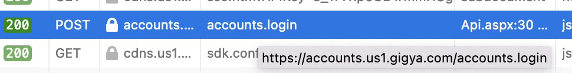

If there is an issue that you faced which has taken at least 30+ minutes of your time, please include it here. Please make sure to go through the other troubleshooting pages before writing your issue. Eventually, your issue (and resolution) may be included in the other parts of the documentation to help others.


## Issue Title
**Date** - 1/1/1111
**Owner** - Aaron Feleke

### Issue

Type the issue here. Type any error codes, warnings, and any other useful materials.

### Resolution

Type the resolution here. Include small code snippets and images.

---

## Is it required to do Certificate Provisioning for DEV, QA, UAT, PROD site groups.
**Date** - 7/22/2022
**Owner** - Aaron Feleke

### Issue

It came up if whether we can go thorugh the Certificate Provisioning Process in a site group then use the API Custom Domain on different site.

### Resolution

Sree recommends: Create a site group. Name it `certificateonly`. It's only purpose is to do the Certificate Provisioning Process on based on the Trusted URL sites. For all other sites, it can use the Custom API Domain Prefix based on the `certificateonly` site group. If you need to add another Trusted URL, add the trusted URL and go through the certificate provisioning process for the new site. No other changes are needed.

If a site is not in the Trusted URL and not part of the Certificate Provisining, will screensets show: Yes OR No (i think no)
Does it work to just have a base domain like feleke.xyz rather than doing Certificate Provisinong for a.feleke.xyz, b.fekeke.xyz, c.feleke.cyz: Yes OR No (i think yes)
If there is a Custom API Domain Prefix for the Parent does it apply automatically to the child if for child sites where there no custom api domain prefix: YES OR NO (i think no)

---

## SAML not working where IP and SP are on different domains
**Date** - July 22, 2022
**Owner** - Aaron Feleke

### Issue

When doing SAML on Firefox (standard cookies) or Safari when the Identity Provider and Service Provider are on 2 different domains (feleke.xyz & google.com), the SAML handshake does not go through.

### Resolution

In Firefox, if you go to Preferences then Privacy & Security then under Enhanced Tracking Protection choose Custom and uncheck Cookies. This made SAML work but when it went back to standard, the SAML handshake did not work. In the future, if you suspect it is a Safari/Firefox issue go to Firefox and go through this proccess.

To fix the issue, go through the [certificate provisioning prcess](https://help.sap.com/docs/SAP_CUSTOMER_DATA_CLOUD/8b8d6fffe113457094a17701f63e3d6a/41450ade70b21014bbc5a10ce4041860.html?q=certificate%20provisioning) and chang the Custom API Domain. When you open inspect in the browser, requests should go through the CNAME (if CNAME is login then go through login.feleke.xyz) not through GIGYA (us1.gigya.com - the image below). 



---

## IDP Initiated Login Does Everything but Log in
**Date** - July 7, 2022
**Owner** - Aaron Feleke

### Issue

- Navigate to http://aaron.cxpoc.com/saml4steps/login.html
- Login to a CDC Account
- Click a button that calls `gigya.fidm.saml.initSSO({"spName": "CDC2", "redirectURL":"https://aaron.cxpoc.com/saml4steps/login2.html"})`
- It successsfully goes through the SAML flow. But, when it goes the `redirectURL`, I am not logged in but see these query params.

`https://aaron.cxpoc.com/saml4steps/login2.html?errorCode=0&provider=saml-metadatacopy&UID=a01b973fd6a54fd48bb7765c0a4067e1&UIDSignature=TP83zUunECIxi8f9UpUnz7isHSU%3d&signatureTimestamp=1657250427&isSiteUser=true&isConnected=true&isTempUser=false&isLoggedIn=true&loginProvider=saml-MetadataCopy&loginProviderUID=HPMRAwlcA%2fI%3d&isSiteUID=false&nickname=Aaron+Feleke&firstName=Aaron&lastName=Feleke&email=fastcdc667%40yopmail.com&capabilities=Login&providers=saml-MetadataCopy&oldestDataUpdatedTimestamp=1657250426&oldestDataAge=1`

### Resolution

Still Investigating.

---

## SP Initiated Login Service Configuration Error
**Date** - July 7, 2022
**Owner** - Aaron Feleke

### Issue

- Navigate to http://aaronsp.cxpoc.com
- Open Login Screenset and choose the CAT Identity Provider or call `gigya.accounts.socialLogin({"provider": "saml-MetadataCopy"});`
- Login into IDP
- It redirects back to http://aaronsp.cxpoc.com with an issue on the screenset in red `Provider configuration error` and error code `400122` from `gigya.showdebugUI()` from the `accounts.socialLogin()` call
- What is interesting is on http://aaron.cxpoc.com/saml4steps/login2.html, which this is based off, works perfectly.


### Resolution

Still Investigating.

---

## SAML Error Page from IDP Initiated Login
**Date** - July 7, 2022
**Owner** - Aaron Feleke

### Issue

- Navigate to http://aaron.cxpoc.com/saml4steps/login.html
- Click a button that calls `gigya.fidm.saml.initSSO()`

```
Error Page
There was an error: "Invalid parameter value" in request ID undefined

{"errorCode":400006,
"errorMessage":"Invalid parameter value",
"callId":"d140a706ece34bc19579622073dfdf60",
"errorDetails":"Invalid argument: loginToken is missing",
"errorDescription":"Invalid argument: loginToken is missing"}
```

### Resolution

To call `gigya.fidm.saml.initSSO`, you need to have to have to have an CDC authenticated session. If you don't, you will get this error. Before calling `gigya.fidm.saml.initSSO` (or clicking a button that calls this), ensure that `gigya.showDebugUI()` shows a logged in user.

---


## Entitlements are not showing on SP from IP-Initiated Login
**Date** - July 2, 2022
**Owner** - Aaron Feleke

### Issue

- Donwload and install SAML-tracer from Chrome Extension Store
- Call `gigya.socialLogin` or customButton on screenset
- Login to the proxy page
- Check onLogin event on the Service Provider

In the SAML ACS from the SP to the IP, you will see these AttributeStatements (aka entitlements)
- map.email	fastcdc003@yopmail.com
- map.lastName	CDC TL
- map.firstName	Aaron 

But, onLogin shows that none of these entitlements were recogonized
        ``` json
       {
        "eventName": "login",
       "provider": "saml-MetadataCopy"
       user: {"email": "",
        "firstName": "",
        "lastName": ""}
        
        ```

### Resolution

On the SP in CDC, correctly map SAML attributes to SP from the IDP (CDC Field Name: IDP Attribute). Check docs for correct CDC Field names as it is weird.
- Email: map.email
- LastName: map.lastName
- FirstName: map.firstName

Another note: I was able to login without any entitlements. When I login using the same user from the IP, it does not create a SP new user but uses the existing user. LoginID is correctly picked up but profile.email remains empty. A random UID is assigned unconnected to the IP.

Another note: If first name or any other attribute is changed on the IP side, then on the next login, it will be overriden by the new valie (e.g. first name)

Another note: If anything is changed from the SP side (e.g. changing firstName in the console, terms), a site identity will be created. The Profiles prefer to show the site ideneity rather than the SMA identity.

---

## SP Initiated Login Service Configuration Error
**Date** - July 2, 2022
**Owner** - Aaron Feleke

### Issue

- Navigate to directly to the proxy page for a SAML Login Flow
```
Error Page
There was an error: "Invalid parameter value" in request ID undefined

{"errorCode":400006,
"errorMessage":"Invalid parameter value",
"callId":"fa1d1b6a646341f68584200199eb8caf",
"errorDetails":"Invalid samlContext",
"errorDescription":"Invalid samlContext"}
```

### Resolution

You cannot navigate directly to a proxy. It needs to be call from the SAML flow like   `gigya.fidm.saml.initSSO` or `gigya.socialLogin` or customButton on screenset

---

## Social Login - Invalid Site Domain
**Date** - July 1, 2022
**Owner** - Aaron Feleke

### Issue

- Navigate to http://omarnames.cxpoc.com
- On the screenset, use the Google Social Login
- The new popup says `Invalid site domain` and in `gigya.showDebugUI()` the `accounts.socialLogin` shows error code `400120` with the status message `General Service Error`

In CDC, Google is enabled on the parent and child site.

### Resolution

https://help.sap.com/docs/SAP_CUSTOMER_DATA_CLOUD/8b8d6fffe113457094a17701f63e3d6a/4144cd9670b21014bbc5a10ce4041860.html?q=captcha
Enter your domains on which the relevant Screen-Sets are hosted.
In the list of domains, also enter a line with console.gigya.com, so that when previewing your registration screen in the UI Builder, Invisible reCAPTCHA will function correctly.

My guess: create out own CAPTCHA credentials with the correct domains.

---

## CAPTCHA not showing 
**Date** - July 1, 2022
**Owner** - Aaron Feleke

### Issue

- Navigate to http://omarnames.cxpoc.com
- Activate the Captcha RBA rule by entering the wrong password for the same login multiple times
- The following text in red shows up on the screenset `To login, confirm you are not a robot` but no captcha shows. I also recieve a warning in the Web Dev Tools `[warn] Missing captcha configuration` although it is there.

The CAPTCHA configuration is in both the parent and child site.

### Resolution

My guess: create our own Google credentials with the correct domains.